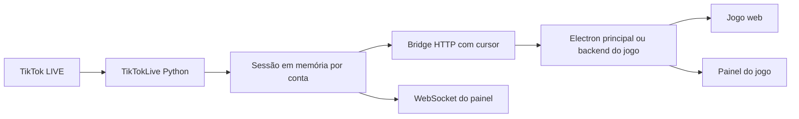

# API Python TikTok Live Manager — contrato para integrar jogos

Contrato atualizado em 30/09/2026 para a **v4.1.0 consolidada neste checkout**, sobre o commit base `83efdb0acde03bf9d158248e67dd9188d53751c7`. As alterações locais ainda não têm commit/deploy publicado.

Este documento descreve `uvicorn app.main:app`. O histórico e as pendências estão em [ANALISE_API_PYTHON.md](ANALISE_API_PYTHON.md).

## 1. Leia antes de implementar

`app/` é a fonte única do backend v4.1, incluindo `app/diagnostics.py`; `static/` contém o painel correspondente e `roblox/` contém o exemplo Lua. As cópias divergentes da raiz foram removidas. `/health`, `/api/meta` e o badge do painel usam a versão 4.1.0.

Não foi consultado um servidor de produção nem aberta uma conexão TikTok real nesta análise. A URL do GitHub é o endereço do código, **não a URL da API**. Confirme a URL do serviço e a versão efetiva antes de integrar. Um deploy configurado manualmente pode diferir do Blueprint analisado.

O arquivo [DOCUMENTACAO_API_LIVE_GATEWAY.md](DOCUMENTACAO_API_LIVE_GATEWAY.md) descreve o gateway anterior. Seus endpoints `/api/v1/game/*`, pontuação e reset de ranking não fazem parte desta API Python.

Decisões recomendadas para o novo PipaJogo:

- Consumir `POST /api/bridge/register` e `GET /api/bridge/{sid}/poll`.
- Usar `profile: "raw"` e manter as regras, o placar e os ciclos no jogo.
- Centralizar a conexão no processo principal do Electron ou num backend próprio. O renderer recebe somente eventos por IPC; não recebe a chave administrativa.
- Compartilhar esse único consumidor entre jogo e painel. Não abrir uma conexão TikTok por tela, jogador ou componente.
- Guardar cursor, deduplicação e fila de efeitos separados da renderização.
- Respeitar `automation_paused_at_ingest` por evento e a pausa atual `automation_paused` também no modo `raw`.
- Usar `user.avatar_url` opcional, com imagem padrão se nula/expirada; não bloquear eventos ao carregar imagens.

## 2. Arquitetura e responsabilidades



| Componente | Responsabilidade atual |
| --- | --- |
| `app/main.py` | Rotas HTTP, WebSocket, validação dos pedidos, arquivos estáticos e inicialização |
| `app/live.py` | Uma tarefa TikTok por sessão, reconexão, normalização, buffer, estatísticas, participantes e broadcast |
| `app/rules.py` | Perfis `raw`, `dance`, `kite`; transforma eventos em descritores de ações |
| `app/auth.py` | API key global e cookie assinado do painel |
| `app/config.py` | Variáveis de ambiente lidas no import |
| `static/` | Painel administrativo web efetivamente servido |
| `roblox/TikTokBridge.server.lua` | Exemplo de consumidor HTTP; não é requisito para outros jogos |
| `render.yaml` | Dependências e comando de execução do deploy |

A API recebe eventos e pode sugerir ações. Ela **não executa** cura, escudo, animação, física ou pontuação do PipaJogo. Essas operações pertencem ao jogo.

As sessões são compartilhadas por username, com comparação sem diferença entre maiúsculas e minúsculas. `@` inicial e espaços externos são removidos. Contas diferentes criam conexões diferentes. O limite padrão é cinco sessões, incluindo sessões offline ainda cadastradas.

Tudo fica em memória de **um processo**: sessões, cursores, regras editadas, estatísticas, participantes e deduplicação. Não usar múltiplos workers ou réplicas sem antes implementar estado compartilhado e um único responsável pela conexão de cada conta.

## 3. Endereço e autenticação

Defina uma base sem `/api` ao final nos exemplos deste documento:

```text
BASE_URL=http://127.0.0.1:8000
# Em produção: https://SEU-SERVICO.onrender.com
```

Rotas do bridge exigem:

```http
X-API-Key: CHAVE_CONFIGURADA_NO_SERVIDOR
```

Pedidos com JSON também usam `Content-Type: application/json`.

| Credencial | Uso |
| --- | --- |
| `API_KEY` | Acesso ao bridge e também às rotas administrativas; não é uma chave limitada ao jogo |
| `DASHBOARD_PASSWORD` | Login do painel; se ausente, o servidor usa a API key como senha |
| `SECRET_KEY` | Assinatura dos cookies; configure um segredo próprio e forte |
| `EULER_API_KEY` | Chave opcional do serviço de assinatura usado pela biblioteca; não autentica pedidos ao bridge |

O login `POST /api/auth/login` recebe `{"password":"..."}` e configura o cookie `live_manager_session`, HttpOnly, SameSite Strict, com validade de sete dias. O atributo Secure depende de `RENDER=true`. O startup no Render exige `SECRET_KEY` e `API_KEY`. Em qualquer ambiente, senha de painel sem segredo/chave falha no startup. Não existe fallback público de assinatura. Fora do Render, configure explicitamente os segredos; detecção de outros ambientes de produção ainda é pendência.

As rotas administrativas aceitam cookie **ou** `X-API-Key`. O bridge aceita **somente** API key. `/api/auth/status` verifica o cookie, não o header.

Não colocar API key em código de frontend, localStorage, URL pública, query string do jogo ou bundle distribuído com uma chave global embutida. No Electron pessoal, fornecer a chave na configuração local e utilizá-la no processo principal. Em um jogo hospedado, manter a chave no backend e autenticar os usuários desse backend separadamente.

Não há configuração de CORS no código atual. Um frontend em outra origem não pode presumir acesso direto por `fetch`. Use um backend intermediário ou, após projeto de autenticação, origens explicitamente permitidas. CORS não protege uma chave já entregue ao navegador.

## 4. Registrar ou reutilizar a sessão

```http
POST /api/bridge/register
X-API-Key: ...
Content-Type: application/json

{
  "username": "seu_usuario_sem_arroba",
  "profile": "raw",
  "consumer_id": "pipajogo-electron"
}
```

Resposta ilustrativa:

```json
{
  "ok": true,
  "created": true,
  "session_id": "0123456789abcdef",
  "username": "seu_usuario_sem_arroba",
  "profile": "raw",
  "cursor": 0,
  "state": "idle",
  "automation_paused": false
}
```

| Campo | Semântica |
| --- | --- |
| `created` | `false` quando já existe uma sessão reutilizável para a conta |
| `session_id` | Identifica a sessão em memória; pode mudar após restart ou desconexão administrativa |
| `cursor` | Sequência atual no momento do registro; iniciar daqui evita reproduzir eventos já no buffer |
| `state` | Estado de conexão naquele instante; registrar não significa que o TikTok já conectou |
| `profile` | Perfil efetivo da sessão |
| `automation_paused` | Indica pausa das automações pelo monitor |

`consumer_id` é aceito, mas **não é utilizado**: não cria fila exclusiva, não armazena ACK, não persiste cursor e não registra atividade do consumidor.

Registrar uma conta existente **preserva perfil e regras ativos**, inclusive regras personalizadas. Mantém HTTP 200 e `created:false`, e acrescenta `requested_profile` e `profile_conflict:true` se o pedido divergir. Não cria outra conexão TikTok. Conferir o conflito antes de executar ações. Trocar perfil exige a rota administrativa explícita. `/api/live/connect` também preserva regras e informa `profile_conflict`.

O registro também retorna `oldest_seq`, `latest_seq` e `gap_detected:false`; inicia no final e não verifica cursor anterior.

Perfis aceitos: `raw`, `dance` e `kite`. Perfil desconhecido recebe 422 nas rotas HTTP sem alterar a sessão.

O registro começa na sequência atual, inclusive ao reutilizar uma sessão. Por isso, **não registrar de novo após cada timeout**: isso pode pular presentes que chegaram durante a interrupção. Repetir o poll com o mesmo cursor enquanto a sessão existir.

## 5. Receber eventos por long polling

```http
GET /api/bridge/0123456789abcdef/poll?after=150&wait=8&limit=100
X-API-Key: ...
```

| Parâmetro | Padrão | Limites | Uso |
| --- | --- | --- | --- |
| `after` | `0` | Inteiro >= 0 | Última sequência assumida pelo consumidor |
| `wait` | `8` | 0 a 15 segundos | Espera máxima quando ainda não há eventos |
| `limit` | `100` | 1 a 250 | Quantidade máxima entregue nesta resposta |

O servidor responde imediatamente se já houver eventos ou quando um novo evento chegar. `wait=8` não acrescenta oito segundos fixos de latência.

Resposta ilustrativa:

```json
{
  "ok": true,
  "cursor_expired": false,
  "events": [
    {
      "seq": 151,
      "id": "aabbccddeeff00112233445566778899",
      "type": "gift",
      "timestamp": 1790769600000,
      "source": "tiktok",
      "data": {
        "user": {
          "unique_id": "espectador",
          "nickname": "Espectador",
          "user_id": "1234567890123456789"
        },
        "gift": {
          "id": "5655",
          "name": "Rose",
          "type": 1,
          "diamond_count": 1
        },
        "repeat_count": 5,
        "repeat_end": 1
      },
      "actions": [],
      "safety": null
    }
  ],
  "cursor": 151,
  "latest_seq": 153,
  "connection_state": "connected",
  "automation_paused": false
}
```

O exemplo é fictício. `actions: []` é normal com perfil `raw`.

Regras obrigatórias do consumidor:

1. Manter no máximo um poll em andamento por consumidor/sessão.
2. Entregar os eventos em ordem de `seq` a uma fila rápida e idempotente. Não aguardar uma animação terminar antes do próximo poll.
3. Deduplicar por `(session_id, id)`; o `id` é um UUID gerado pelo gateway, não o ID original do TikTok. Também pode usar sequência dentro da sessão.
4. Atualizar o cursor somente depois de assumir os eventos na fila escolhida. Se precisar sobreviver a encerramento do processo, persistir a fila e o cursor de forma consistente.
5. Usar `response.cursor`. **Nunca avançar diretamente para `latest_seq` em uma resposta normal**: ele pode incluir eventos que ficaram para o próximo lote.
6. Se `cursor < latest_seq`, buscar o próximo lote imediatamente. Quando alcançar o final, voltar ao long polling.
7. Um timeout ou erro transitório não deve apagar sessão, deduplicação nem cursor. Usar backoff com variação aleatória, por exemplo de 1 até 30 segundos.
8. Usar timeout HTTP maior que `wait`, por exemplo 20–25 segundos para espera de 8–15 segundos. Inicialização a frio do provedor pode exigir tentativas adicionais.
9. Tipos desconhecidos devem ser registrados/ignorados sem quebrar o loop, mas seu cursor também precisa avançar.

Repetir o mesmo `after` pode retornar os mesmos IDs. Não há confirmação de recebimento no servidor nem garantia de entrega exatamente uma vez.

### Cursor expirado

O buffer padrão retém 2.500 eventos por sessão, incluindo diagnóstico e conexão. Se `after < oldest_seq - 1`, a resposta é:

```json
{
  "ok": true,
  "cursor_expired": true,
  "events": [],
  "cursor": 2800,
  "latest_seq": 2800,
  "automation_paused": false
}
```

O exemplo abrevia os campos adicionais: a resposta atual também inclui `connection_state`, `session_id`, `oldest_seq` e `gap_detected:true`.

O comportamento padrão **pula para o final**. O consumidor pode adotar o cursor retornado ou optar pela recuperação do trecho retido descrita abaixo, usando o cursor original. Em ambos os casos, registrar a lacuna e informar o operador. Não inventar recompensas para preencher o intervalo; recuperar itens já removidos exigiria persistência.

### Sessão desapareceu

Ao receber `404 Session not found`, registrar novamente, usar a nova sessão e seu cursor, e iniciar outro espaço de deduplicação. Um restart também perde todo o histórico da API. Reiniciar a conexão não restaura eventos perdidos durante a indisponibilidade.

Não desconectar a sessão ao terminar uma rodada do jogo. Isso interrompe todos os consumidores, descarta o buffer e cria necessidade de nova conexão TikTok. Reinicie somente o estado da rodada.

### Pseudocódigo de referência

```text
registrar uma vez -> session_id, cursor, automation_paused
enquanto aplicação estiver ativa:
    fazer poll(session_id, after=cursor, wait=8, limit=100)
    se 404:
        registrar novamente; substituir session_id/cursor
        continuar
    se 401 ou 503 por chave ausente:
        mostrar erro de configuração e suspender tentativas automáticas rápidas
    se erro transitório:
        esperar backoff com jitter; manter session_id/cursor; continuar
    se cursor_expired:
        registrar perda; atualizar cursor; continuar
    atualizar indicador de conexão e pausa
    para cada evento em ordem:
        verificar duplicata usando session_id + id
        guardar em fila/registro local sem esperar efeitos visuais
        decidir execução segundo source, tipo e estado de pausa
    confirmar cursor entregue depois de assumir o lote
    repetir imediatamente para esvaziar backlog ou aguardar no próximo poll
```

### Recuperação explícita do buffer

Todo poll, inclusive vazio/expirado, retorna `session_id`, `oldest_seq`, `latest_seq` e `gap_detected`. A identificação muda após restart. Cursor maior que `latest_seq` também é inválido/expirado.

Para preservar clientes existentes, o padrão continua `cursor_expired:true`, `events:[]` e cursor atual quando há expiração. Para recuperar o trecho disponível, repetir **com o cursor original** e `recover=true`. Uma lacuna anterior ao buffer retorna `gap_detected:true`, `cursor_expired:false`, eventos retidos paginados e cursor do último entregue. Usar esse cursor na próxima página. Itens removidos não são recuperados: registrar a perda e deduplicar por ID no jogo. Cursor à frente do servidor continua inválido mesmo com `recover=true`.

Não há ACK, offsets por consumidor, entrega exatamente uma vez ou persistência após restart. Novo registro começa no final. Repetir poll após timeout; somente 404 exige novo registro.

## 6. Formato dos eventos

| Campo | Tipo/semântica |
| --- | --- |
| `seq` | Inteiro crescente, local à sessão |
| `id` | String UUID hexadecimal gerada pela API |
| `type` | String em inglês e minúsculas |
| `timestamp` | Inteiro Unix em milissegundos do recebimento/processamento pela API; não é o horário original do TikTok |
| `source` | `tiktok`, `simulation` ou `control` (reset de segurança); erros de conexão usam `tiktok` |
| `data` | Payload normalizado; `{}` para eventos não gameplay no bridge |
| `actions` | Lista de descritores de ações; vazia em `raw` ou quando pausado |
| `safety` | `null` ou metadados do monitor |
| `schema_version` | Inteiro `1` nesta versão |
| `automation_paused_at_ingest` | Booleano: pausa no instante de processamento do evento, preservada após reset |

No endpoint administrativo `/events`, na resposta de `/simulate` e no WebSocket, o objeto completo também contém `session_id`, `username` da live e `simulated`. O **bridge remove esses três campos**; identifique a sessão pelo contexto do pedido e simulação por `source`.

### Usuário

```json
{
  "unique_id": "espectador",
  "nickname": "Nome na tela",
  "user_id": "1234567890123456789"
}
```

`data.user` e seus campos podem ser nulos. IDs numéricos vêm como **strings**: não converter para Number em JavaScript, para evitar perda de precisão. Preferir `user_id` como identidade estável e usar `unique_id` como fallback; nickname serve para exibição, não como chave.

O usuário normalizado inclui `avatar_url:string|null`, extraída de `avatar_thumb.url_list`, com fallback para `avatar_medium` e `avatar_large`. Não há consulta adicional de perfil. O ranking mantém a última URL observada do participante. Use imagem padrão se ausente/expirada. Não existem `points` ou `pontos`. Renderize comentários e apelidos como texto, não HTML. A simulação pode omitir avatar.

### Payloads de gameplay

| `type` | Campos de `data`, além de `user` | Interpretação |
| --- | --- | --- |
| `comment` | `comment: string` | Texto do comentário |
| `like` | `count: integer`, `total: number ou null` | `count` é o incremento deste evento; não somar `total` repetidamente |
| `follow` | Nenhum | Uma notificação de follow |
| `share` | Nenhum | Uma notificação de compartilhamento; sem quantidade normalizada |
| `gift` | `gift`, `repeat_count`, `repeat_end` | Presente ou combo finalizado |
| `subscription` | `raw` nos eventos reais; apenas `user` nas simulações | Notificação opcional, disponível se o tipo existir na biblioteca |

`gift` contém `id: string ou null`, `name: string ou null`, `type: integer ou null`, `diamond_count: integer`. O valor pode ser zero quando não resolvido; não presumir preço mínimo ou converter diretamente para dinheiro real.

### Presentes e combos

Para presentes de `gift.type == 1`, o backend ignora eventos intermediários enquanto `event.streaking` for verdadeiro. O evento final contém o total em `repeat_count`.

Exemplo: `diamond_count=1`, `repeat_count=5` corresponde a cinco unidades e cinco moedas na contagem desta API. Aplicar esse total **uma vez**. Não tratar como incremento de um combo anterior que o bridge não entregou.

Não presumir que `repeat_end == 1` seja obrigatório para presentes de todos os tipos. O filtro do backend usa a combinação de tipo e `streaking` da biblioteca.

A deduplicação de origem depende de um ID de mensagem/log quando disponível e guarda até 4.000 IDs por sessão. Eventos sem esse ID não recebem essa proteção. O UUID do bridge evita repetir um item do buffer no consumidor, mas não corrige duas inserções distintas do mesmo evento de origem.

### Conexão e diagnóstico

Também podem chegar: `connect`, `disconnect`, `live_end`, `live_pause`, `live_unpause`, `connection_error`, `unknown`, `bottom_notice`, `perception`, `partnership_punish`, `room_verify`, `gift_restriction`, `access_control`, `gift_prompt`, `notice`, `room_notify`, `system`, `in_room_banner`, `toast`, `access_recall`.

No bridge, esses tipos trazem `data: {}`. Para detalhes de erro, `room_id`, espectadores ou payload de diagnóstico, consultar o status ou os endpoints administrativos. Atualizações de espectadores usam `kind: "status"` no WebSocket; não criam necessariamente um evento no buffer.

Estados de conexão presentes no código: `idle`, `connecting`, `connected`, `reconnecting`, `offline`, `error`, `stopped`. Estar com `/health` saudável não significa que uma live esteja conectada.

## 7. Monitor e pausa

O monitor v4.1 usa `safety.level`: `INFO`, `HISTORICAL`, `OBSERVATION`, `ALERT`, `CRITICAL`. Avalia conteúdo, timestamp, quarentena inicial e corroboração. Payload vazio ou histórico não provoca pausa por si só. Sinal forte atual com conteúdo, ou alertas corroborados, pode ser CRITICAL. Pausa automática exige `auto_pause:true` e `safety_auto_pause_critical:true`.

Para compatibilidade, `safety.severity` continua presente: `high` para CRITICAL, `medium` para OBSERVATION/ALERT e `info` nos demais níveis. Novos consumidores devem usar `level` e o contexto de pausa por evento.

`STORE_RAW_DIAGNOSTICS` controla retenção/exposição do payload, sem mudar a classificação. Estruturas profundas são truncadas sem convertê-las em texto. Eventos informativos vazios e diagnósticos repetidos são suprimidos. Não há buffer separado para presentes.

**A pausa não interrompe a coleta.** Estatísticas e eventos raw continuam, com `actions` vazio. Cada envelope, inclusive no bridge, contém `schema_version:1` e `automation_paused_at_ingest:boolean`. Após reset, ainda é possível identificar presentes recebidos durante a pausa. Não executá-los automaticamente; eventual revisão manual deve usar fila separada no jogo. A API não persiste essa fila.

`POST /api/live/{sid}/safety/reset` limpa pausa/alerta e corroboração e insere o evento sequenciado `safety_reset`, `source:"control"`. No bridge seu `data` é vazio, como nos demais controles. Não reconecta nem recompõe ações anteriores. `live_paused` se refere à transmissão e é independente.

## 8. Perfis e motor de regras

Existem duas estratégias. Escolher uma para evitar efeitos em dobro:

| Estratégia | Quem decide o gameplay | Consumo |
| --- | --- | --- |
| `raw` — recomendada para migrar PipaJogo | O jogo | Interpretar `event.type` e `event.data`; não executar também `actions` |
| `kite`, `dance` ou regras personalizadas | Motor de regras da API | Executar `actions`; o jogo implementa cada tipo de ação |

O perfil `kite` não reproduz automaticamente todas as regras atuais do PipaJogo. Ele apenas define:

| Gatilho | Ações padrão |
| --- | --- |
| Comentário | `spawn`, nome `kite_from_comment` |
| Like | `heal`, amount igual à quantidade de likes |
| Follow ou share | `shield`, duração 10 |
| Gift com nome Rose | `heal`, amount 200; e `attack`, nome `special` |
| Gift com total >= 5 moedas | `giant`, scale 1.8, duração 15 |

As regras acumulam: cinco Roses de uma moeda satisfazem Rose **e** total >= 5. A cura fixa 200 não é multiplicada automaticamente por cinco; `amount_per_count` é a operação que escala pelo count. `Rose` é comparado sem diferença de maiúsculas, mas não há tradução automática para `Rosa`.

O perfil `dance` cria avatar em comentário, aura de 12 em follow, animação `special` em Rose e `giant` scale 2.0/duração 15 para total >= 5 moedas.

Tipos de ações aceitos: `heal`, `shield`, `aura`, `animation`, `giant`, `spawn`, `sound`, `attack`, `custom`, `score`, `speed`. São dados declarativos; não há execução arbitrária de código.

Exemplo de atualização de regras:

```http
PUT /api/live/{sid}/rules
Content-Type: application/json
X-API-Key: ...

{
  "rules": [
    {
      "id": "likes_cura",
      "enabled": true,
      "when": {"type": "like", "min_count": 1},
      "actions": [{"type": "heal", "amount_per_count": 1}]
    }
  ]
}
```

Condições implementadas: `type`, `gift_name`, `min_count`, `min_coins`, `comment_contains`. Não existe condição por gift ID. Campos desconhecidos em `when` são rejeitados.

Cada ação resolvida acrescenta `rule_id`, `event_type`, `user` quando existente; para gifts, também `gift`, `gift_count`, `gift_coins`. `amount_per_count` é substituído por `amount` calculado. Há limite de 100 regras; mais de 20 ações por regra são rejeitadas. IDs de regra duplicados geram erro.

`min_count` e `min_coins` exigem inteiros entre 0 e 1.000.000.000; `enabled` exige booleano. Condições/tipos de evento desconhecidos são rejeitados. `amount_per_count`, `amount`, `duration`, `scale` e `speed` exigem números finitos com módulo até 1.000.000.000. Regras inválidas preservam as anteriores. Falhas numéricas inesperadas no motor são registradas e deixam o evento sem ações, preservando coleta. Metadados personalizados de ações continuam aceitos; modelos completos e limites profundos ainda são pendências. Regras e perfis não persistem após restart.

## 9. Referência das rotas HTTP

Legenda: **pública** = sem credencial; **admin** = cookie ou API key; **bridge** = API key obrigatória.

| Método e caminho | Autenticação | Entrada e retorno |
| --- | --- | --- |
| `GET /` | Pública | HTML do painel; dados exigem login |
| `GET /health` | Pública | `ok`, `version`, `sessions`, `max_sessions` |
| `GET /docs`, `/redoc`, `/openapi.json` | Pública, padrão FastAPI | Documentação gerada; respostas não têm modelos completos declarados |
| `GET /api/auth/status` | Pública | `authenticated` pelo cookie, `password_configured` |
| `POST /api/auth/login` | Pública | `{password}`; retorna `{ok:true}` e cookie |
| `POST /api/auth/logout` | Pública | Apaga cookie e retorna `{ok:true}` |
| `GET /api/meta` | Admin | `version`, `max_sessions`, `profiles`, `render_free_note` |
| `GET /api/live/sessions` | Admin | `{sessions:[snapshot,...]}` |
| `POST /api/live/connect` | Admin | `{username,profile:"raw"}`; retorna `created` + snapshot na raiz |
| `POST /api/live/{sid}/disconnect` | Admin | Para e remove a sessão inteira; `{ok:true}` |
| `GET /api/live/{sid}/status` | Admin | Snapshot |
| `GET /api/live/{sid}/events` | Admin | `after>=0`, limit padrão 150/máximo 500; `{events,latest_seq,oldest_seq,has_more}` |
| `PUT /api/live/{sid}/config` | Admin | `{config:{...}}`; retorna config diretamente |
| `PUT /api/live/{sid}/rules` | Admin | `{rules:[...]}`; `{ok:true,rules}` |
| `POST /api/live/{sid}/profile` | Admin | `{profile}`; `{ok:true,profile,rules}` |
| `POST /api/live/{sid}/safety/reset` | Admin | Limpa pausa/alerta e emite controle sequenciado; `{ok:true}` |
| `POST /api/live/{sid}/simulate` | Admin | Evento simulado; retorna o evento completo diretamente |
| `GET /api/live/{sid}/leaderboard` | Admin | `sort`, limit padrão 50/máximo 100; `{rows:[...]}` |
| `GET /api/live/{sid}/export.json` | Admin | `{session,events,leaderboard}`; somente buffer retido e top 100 por coins |
| `GET /api/live/{sid}/export.csv` | Admin | CSV UTF-8 com BOM do buffer; colunas seq, timestamp, type, source, user, detail, actions |
| `POST /api/bridge/register` | Bridge | Registro conforme seção 4 |
| `GET /api/bridge/{sid}/poll` | Bridge | Long polling conforme seção 5 |

`/events` é uma leitura imediata em ordem crescente de sequência, sem espera e sem a política `cursor_expired` do bridge. `after=0&limit=500` busca os **primeiros** 500 itens retidos, não necessariamente os mais recentes.

### Snapshot

Campos presentes no runtime 4.1:

```text
session_id, username, profile, connection_state,
connected, live, live_paused, automation_paused,
room_id, viewers, last_event_at, last_error, reconnects,
safety_state, last_safety_event, last_monitor_event, created_at, connected_at,
stats, config, rules, latest_seq, oldest_seq, queued_events, participants
```

Datas usam milissegundos Unix; campos ainda desconhecidos podem ser nulos. `participants` é a quantidade armazenada, não uma lista nem o total de espectadores. `queued_events` é o tamanho do buffer retido, não quantos eventos o seu jogo ainda precisa executar.

`stats`: `comments`, `likes`, `follows`, `shares`, `gifts`, `gift_coins`, `subscriptions`, `diagnostics`, `simulations`.

`config`: `comment_enabled`, `like_enabled`, `follow_enabled`, `share_enabled`, `gift_enabled`, `safety_auto_pause_critical`, `count_simulations_in_stats`. Todos começam true exceto `count_simulations_in_stats`, que começa false. Booleanos são estritos: `"false"` recebe 422. Campos desconhecidos recebem 400 sem aplicação parcial. O alias legado `safety_auto_pause_high` é aceito na escrita e mapeia para a política crítica; aliases conflitantes recebem 400. Respostas usam o nome novo.

### Ranking

Ordenações aceitas: `coins`, `gifts`, `likes`, `comments`, `shares`, `follows`. Um valor desconhecido usa `coins`.

Cada linha tem `unique_id`, `nickname`, `user_id`, `avatar_url`, `comments`, `likes`, `follows`, `shares`, `gifts`, `coins`. Não contém pontuação ponderada do jogo nem identificação de rodada. `coins` soma `diamond_count * repeat_count`.

O limite padrão de participantes é 2.000: quando cheio, participantes novos deixam de entrar no ranking. As estatísticas gerais podem continuar aumentando. Não há rota de reset do ranking, de início de rodada ou de consulta de campeão. O jogo precisa controlar sua própria pontuação por ciclo.

### Erros

| Status | Significado e conduta |
| --- | --- |
| `400` | Username inválido, simulação não suportada ou regras rejeitadas; corrigir pedido |
| `401` | Credencial ausente/inválida; corrigir configuração/login |
| `404` | Sessão não encontrada; no bridge, registrar novamente |
| `409` | Limite de sessões; revisar sessões administrativas, sem loop rápido |
| `422` | Validação Pydantic/query; corrigir tipos ou limites |
| `503` | Bridge sem `API_KEY` configurada no servidor |
| `5xx`/timeout/rede | Manter cursor/sessão e aplicar backoff; analisar falhas persistentes |

Erros FastAPI usam normalmente `{"detail":...}`; em 422, `detail` pode ser uma lista. Proxies/provedores podem retornar HTML. O bridge não implementa atualmente resposta 410, ACK ou cabeçalho de rate limit próprio. Um cliente pode tratar 429 de infraestrutura com espera, sem supor que isso seja um endpoint implementado.

## 10. WebSocket do painel

Endpoint `/ws` (`ws://` local ou `wss://` em HTTPS). Autentica por cookie ou por `?key=API_KEY`. A opção de chave na URL existe, mas não é recomendada: pode aparecer em registros de acesso. Não há filtro por sessão, autorização por conta ou protocolo de assinatura de canais.

Mensagens:

```json
{"kind":"hello","version":"4.1.0"}
```

```json
{"kind":"event","event":{"session_id":"...","seq":1,"type":"comment"}}
```

```json
{"kind":"status","session":{"session_id":"...","connection_state":"connected"}}
```

O evento está abreviado. Status de espectadores é compacto: `session` contém `session_id` e `viewers`; fazer merge no estado local. O cliente envia a string `ping`; o servidor responde a string `pong`, que não é JSON. O painel faz isso a cada 30 segundos.

O painel atualiza o feed pelo evento recebido e consulta sessões a cada cinco segundos, com no máximo uma consulta pendente. Eventos não disparam HTTP. Login/logout/expiração limpam polling, ping e reconexão.

O WebSocket envia eventos de **todas as sessões** aos clientes autorizados. Não oferece replay, cursor ou ACK. Desconectar perde as mensagens do intervalo. Para o primeiro jogo, usar o bridge como fonte de gameplay; não executar simultaneamente eventos do WS e do poll. Um futuro WS específico do jogo precisa de filtro, autenticação limitada e retomada por cursor.

## 11. Testar a integração sem presentes reais

O simulador existe, mas registrar/conectar ainda inicia uma tentativa de conexão TikTok. **Não há sessão offline de simulação isolada** no contrato atual. Para testes totalmente sem rede externa, mockar o conector ou acrescentar esse modo à API.

Em uma sessão de desenvolvimento, registrar primeiro, guardar seu cursor e depois simular:

```http
POST /api/live/{sid}/simulate
Content-Type: application/json
X-API-Key: ...

{
  "type": "gift",
  "username": "teste_pipa",
  "gift_name": "Rose",
  "gift_coins": 1,
  "count": 5
}
```

Outros pedidos:

```json
{"type":"comment","username":"teste_pipa","comment":"quero uma pipa"}
```

```json
{"type":"like","username":"teste_pipa","count":20}
```

```json
{"type":"follow","username":"teste_pipa"}
```

`share` e `subscription` também são aceitos. `gift_coins` aceita 0–1.000.000; `count`, 1–1.000.000. Padrões: username `Teste`, gift `Rose`, valor 1, count 1, comentário `teste`.

Simulações geram eventos reais no buffer compartilhado e podem gerar ações. Por padrão, incrementam `stats.simulations`, mas não o ranking nem os contadores reais. Elas contornam os toggles como `gift_enabled`, pois entram diretamente em `push`. A pausa de automação continua afetando as ações geradas.

No jogo, aceitar `source: "simulation"` somente em modo de teste explícito. Registrar e avançar o cursor mesmo quando ignorar esses eventos em produção. Caso contrário, o simulador administrativo pode contaminar o placar local.

Critérios de aceitação para a futura implementação:

- Comentário cria/identifica exatamente uma pipa do usuário.
- Like aplica `count` uma vez; gift de cinco Roses é contado uma vez pelo total correto.
- Receber novamente o mesmo ID não repete recompensa.
- Um lote limitado não pula de `cursor` para `latest_seq`.
- Timeout mantém a sessão; 404 registra novamente; expiração registra perda visível.
- Pausa bloqueia gameplay sem interromper coleta nem causar replay automático na retomada.
- Simulação não altera partida real inadvertidamente.
- Ausência de avatar, nickname ou usuário não derruba o consumidor.
- Fim de rodada não desconecta o bridge e não reaplica presentes anteriores.
- Janela em segundo plano continua recebendo eventos; renderização/captura no TikTok Studio é validada separadamente.

## 12. Executar a API localmente

Na raiz de um checkout da API Python, não na pasta do jogo:

```powershell
python -m venv .venv
& .\.venv\Scripts\python.exe -m pip install -r requirements.txt

$env:API_KEY = "chave-apenas-para-desenvolvimento"
$env:SECRET_KEY = "segredo-apenas-para-desenvolvimento"
$env:DASHBOARD_PASSWORD = "senha-apenas-para-desenvolvimento"
$env:AUTO_CONNECT_USERS = ""

& .\.venv\Scripts\python.exe -m uvicorn app.main:app --host 127.0.0.1 --port 8000
```

Abra `http://127.0.0.1:8000`. Os valores acima são exemplos de desenvolvimento, não credenciais existentes. O código usa `os.getenv`: copiar `env.example` para `.env` sozinho não carrega o arquivo. Exporte variáveis ou use explicitamente o suporte `--env-file` do Uvicorn.

Execute a partir da raiz porque `static/` é resolvido relativamente ao diretório de trabalho. `--reload` é útil ao desenvolver, mas cada recarga perde sessões/histórico; não usar durante uma live.

| Variável | Padrão efetivo v4.1 | Efeito |
| --- | --- | --- |
| `MAX_SESSIONS` | 5 | Quantidade máxima de sessões cadastradas |
| `MAX_EVENTS` | 2500 | Eventos retidos por sessão |
| `MAX_PARTICIPANTS` | 2000 | Participantes retidos por sessão |
| `OFFLINE_RETRY_SECONDS` | 30 | Intervalo de nova tentativa após offline |
| `RECONNECT_BASE_SECONDS` | 5 | Espera inicial após falhas |
| `RECONNECT_MAX_SECONDS` | 60 | Teto do backoff |
| `IGNORE_BROKEN_PAYLOAD` | true | Tolerância da biblioteca a payloads quebrados |
| `STORE_RAW_DIAGNOSTICS` | true | Retenção de payload sanitizado de diagnóstico |
| `AUTO_CONNECT_USERS` | Vazio | Ex.: `conta1:raw,conta2:kite`; inicia conexões no startup |
| `EULER_API_KEY` | Vazio | Configura assinatura de terceiros quando fornecida |
| `RENDER` | false fora do Render | Controla Secure do cookie |
| `LOG_LEVEL` | INFO | Nível de log |

As variáveis `DIAGNOSTIC_*` estão ativas: grace 15s, frescor 120s, quarentena 20s, corroboração 20s e supressão 30s por padrão. Configurações numéricas precisam ser válidas; não há validação robusta dos intervalos no startup atual.

## 13. Contexto pronto para entregar à IA do jogo

```text
Crie o PipaJogo web/Electron usando DOCUMENTACAO_API_PYTHON.md como contrato
da API, e leia ANALISE_API_PYTHON.md antes de implementar a integração.
O contrato é a v4.1.0 consolidada localmente sobre o commit base 83efdb0acde03bf9d158248e67dd9188d53751c7.
Confirme novamente a versão se a API tiver sido corrigida desde então.

Use profile raw, registro /api/bridge/register e long polling por cursor.
Mantenha um consumidor no processo principal do Electron, com a API key
na configuração local. Entregue eventos ao renderer por IPC restrito.
Não exponha a chave no frontend e não conecte o TikTok diretamente no renderer.

Implemente deduplicação, paginação, backoff, recuperação de 404, alerta de
cursor expirado e fila de efeitos independente do recebimento de eventos.
Respeite automation_paused_at_ingest e a pausa atual; filtre simulações fora do modo de teste.
Calcule pontuação, campeão e ciclos no jogo; essa API não fornece esses
recursos nem reset de ranking. Não desconecte a sessão ao reiniciar rodada.

Use avatar_url opcional. Não presuma pontos, replay persistente, ACK, consumer_id funcional
ou WebSocket com filtro de sessão. Não use os endpoints do gateway antigo.
Não aplique simultaneamente raw e actions ao mesmo evento.
Preserve todas as regras já validadas do jogo, consultando também o código
Godot e o documento de visão; o perfil kite da API não é uma especificação
completa do gameplay atual.
```

## 14. Fontes do contrato

Referências históricas do commit base (anteriores às correções; o contrato final usa este checkout):

- [Rotas e modelos de pedidos — app/main.py](https://github.com/juliogitdev/live-manager-tiktok/blob/83efdb0acde03bf9d158248e67dd9188d53751c7/app/main.py).
- [Sessões, normalização e reconexão — app/live.py](https://github.com/juliogitdev/live-manager-tiktok/blob/83efdb0acde03bf9d158248e67dd9188d53751c7/app/live.py).
- [Motor e perfis — app/rules.py](https://github.com/juliogitdev/live-manager-tiktok/blob/83efdb0acde03bf9d158248e67dd9188d53751c7/app/rules.py).
- [Autenticação — app/auth.py](https://github.com/juliogitdev/live-manager-tiktok/blob/83efdb0acde03bf9d158248e67dd9188d53751c7/app/auth.py).
- [Configuração — app/config.py](https://github.com/juliogitdev/live-manager-tiktok/blob/83efdb0acde03bf9d158248e67dd9188d53751c7/app/config.py).
- [Deploy — render.yaml](https://github.com/juliogitdev/live-manager-tiktok/blob/83efdb0acde03bf9d158248e67dd9188d53751c7/render.yaml).

Os testes da análise usaram ASGI local e eventos artificiais. Eles verificam contrato e lógica, não a disponibilidade atual de uma live nem a entrega pelo TikTok.
